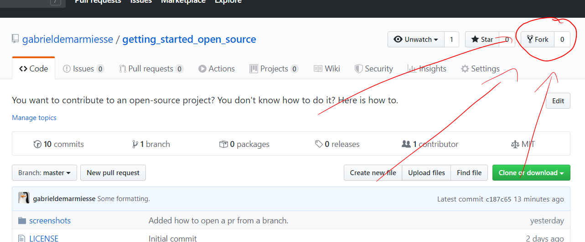
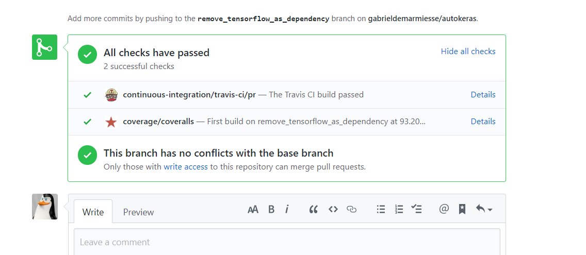
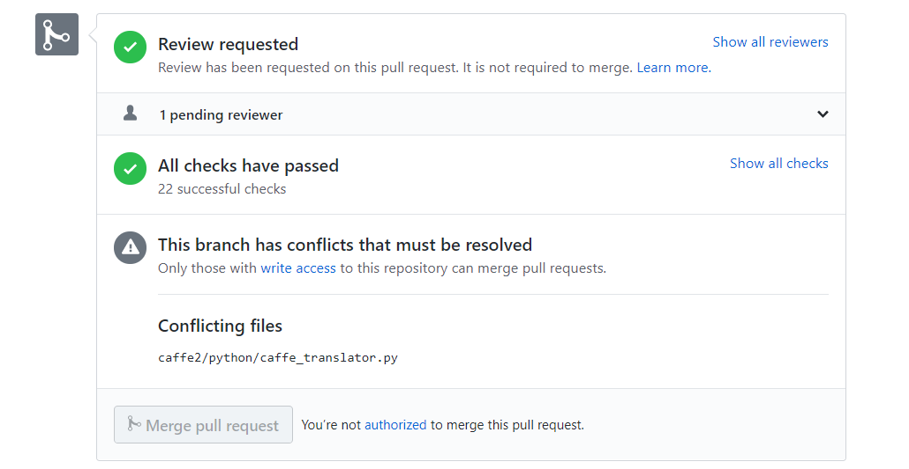
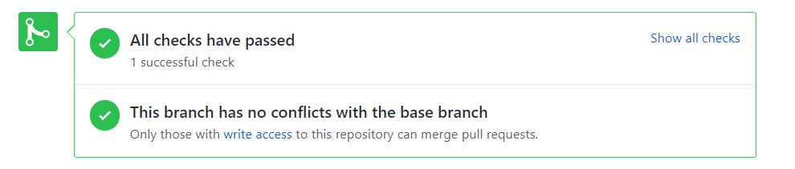

# Making a pull request to an open-source project

You want to make a pull request to an open-source project? You don't know how to do it? Here is how to.

This guide will show you how to make a contribution (modifying code, adding things in the docs...) to an open source project that you don't own.


### This guide will assume that:

1) You know how to use git, at least you know what is a commit and a branch and a few basic commands.
2) You know which project you want to work on. In this guide, we'll assume that it's an open source project that you don't control and that the repository is hosted on GitHub. For example, it could be [Cython](https://github.com/cython/cython), [the Windows terminal](https://github.com/microsoft/terminal) or [Tensorflow](https://github.com/tensorflow/tensorflow).
3) You know what modifications you want to do. What I mean is you know which files you want to modify and which lines.

In here, as example, we'll say that your GitHub username is `my_pretty_username` and that you want to make a pull request to this repository: `github.com/gabrieldemarmiesse/getting_started_open_source`

You can follow the tutorial and make dummy pull requests to this repository. Think of it as a sandbox, it's made to learn, so no worries if you mess up! (Actually, you can't mess it up, because only I have the write permissions on it.)

### Step 1: Making a fork

First head to the page of the project, in my example, https://github.com/gabrieldemarmiesse/getting_started_open_source . If you look at the top right of the page, you'll see a button called "Fork":
 
 
 
 Click on it and create your fork. It will redirect you to your fork.
 
 #### What is a fork?
 
 In short, a fork is a copy of a repository. In our case:
 
 * https://github.com/gabrieldemarmiesse/getting_started_open_source is upstream.
 * https://github.com/my_pretty_username/getting_started_open_source is the fork. 
 
 The fork is one of your repositories. Since it's your own repository now, you can pull and push as much as you want. When people talk about a fork, they also talk about the upstream repository (original repository). You'll see later how to update your fork with commits for the upstream repository.
 
 ### Step 2: Cloning your fork
 
 You now have your fork under your username: https://github.com/gabrieldemarmiesse/getting_started_open_source . You'll use it to work since I can push and pull with it. Click on the green "Clone" button (of your fork, not the upstream repository) and use it to clone locally. For example, in your case, you can do:
 
 ```bash
git clone https://github.com/my_pretty_username/getting_started_open_source.git
```

to clone with HTTPS or 

```bash
git clone git@github.com:my_pretty_username/getting_started_open_source.git
```

to clone it with SSH.

### Step 3: Make a new branch to make your modifications

It's never a good idea to work on the master branch. It'll become clear why once you start doing your second pull request. So let's make a new one:
```bash
cd ./getting_started_open_source
git checkout -b my_pretty_branch_for_pr_1
git status
```

You're now on the new branch `my_pretty_branch_for_pr_1` and ready to work! 

Remember: one branch = one pull request. The branch name doesn't have to be the name of your pull request, so no worries if your branch name is bad or not very descriptive.

### Step 4: Modify the code/docs

Find the file you want to modify and modify it. Change the code, etc... I won't detail here how to run the test suite as it's optional in open source projects. Especially if the modification is small. A server will run some tests for you anyway. So let's go on.

### Step 5: Push your branch

This is quite simple:
```bash
git add .
git commit
git push
```

If you go to your fork, you'll see that your branch is now there (you can click on the branch button to see).


### Step 6: Opening the pull request

Now head to the original(upstream) repository. Click on the tab "Pull requests", you should see a banner saying something like 

> my_pretty_username:my_pretty_branch_for_pr1 (one minute ago). 
>
> Compare & pull request 

Click the green button and you'll be able to review the diff, add a title to your pull request and add a description. 

Don't worry, you'll be able to modify the pull request (title, descriptions and add commits) later on if needed.


### Step 7: The continuous integration system

Every time you open a pull request or add a commits to it, it will trigger tests in a CI system.

You can see the CI and the logs at the bottom of the pull request:

 

If the CI is failing, you can see why by checking the logs. For that, click on "Details".

#### What is a CI system?

CI stands for "Continuous integration". It's a system that runs on a server. It watches your git repository closely.

Every time you add a commit to the repository, or every time a pull request is opened, the CI system will spawn a fresh new virtual machine, clone the repository, checkout to the commit that was just added and runs many tests. It then reports the result.

There are nowadays many CI providers: Travis CI, CircleCI, Azure pilelines, Github actions...


### Step 8 (optional): Add more commits to your pull request

The pull request is now done, but there is still the code review. You might need to wait for a few days until a maintainer reviews your code. 

Once the maintainer does, if everything is good, you'll get some thanks and your pull request will be merged.

If the maintainer asks for changes (which is frequent), you need to modify the code. In this case **do not open another pull request**. As was said earlier, one branch = one pull request. You just need to do:

```bash
git checkout my_pretty_branch_for_pr_1
```
In case you were not on this branch already. 

Then do the requested code modifications and do:

```bash
git add .
git commit
git push
```

The commit will be added to the branch. You should see it appear in the pull request page. You'll also trigger the continuous integration system again with this new commit.

Repeat step 8 until your pull request is merged!


### Step 9: Make a second pull request

Your first pull request was merged. Maybe you think it was easier than you thought and you'd like to do it again.

You may be very tempted to delete your fork and redo steps 1 to 8 again. 
There is obviously a better solution... Here is the setup that you need to do only once. All your future pull requests will be easier to make now.

#### Step 9.1: Sync your local master branch with the upstream master branch

If you remember, we said earlier that working on the master branch wasn't a good idea. You'll understand why now. We need the master branch to be in sync with the upstream master branch.

Some commits have been added to the upstream master branch. To pull them locally, you need to add the upstream repo as a remote. To do that, head to the upstream repository, click on "Clone this repository" and select HTTPS. Then execute the command:

```bash
git remote add upstream https://github.com/gabrieldemarmiesse/getting_started_open_source.git
```

Then:
```bash
git remote -v
```

To read the output:
* `upstream` = The upstream (original) repository.
* `origin` = Your fork.

By default, if you use `git push` and `git pull`, it'll still use `origin`. We want to change that for the master branch. We want the master branch to be in sync with `upstream` and not `origin` so that you can always work with the latest version of the code:

```bash
git fetch upstream
git checkout master
git branch --set-upstream-to upstream/master
git status
```

Now, to get the latest commits added to the upstream repository, just do:

```bash
git checkout master
git pull
```

#### Step 9.2: Make a new branch to make your modifications

It's identical to step 3

```bash
git checkout -b my_pretty_branch_for_pr_2
# do your work here
git add .
git commit
git push
```

Now go to the upstream repository web page, click on "Pull requests" and click on the button "Compare & pull request".

### Step 10: Make a third pull request.

I believe it's easy to understand what to do at this point. But just in case, here are the commands to execute to make a third pull request, given that you followed all the previous steps:

```bash
git checkout master
git pull                 # get the latest changes
git checkout -b my_pretty_branch_for_pr_3
# do your work here
git add .
git commit 
git push
```

Go to the upstream repo web page and click on "Compare & pull request".


### Step 11: Fixing merge conflicts.

Sometime, you'll see this status on your pull request:



It's a merge conflict. What does it mean for you?

You made modifications on some lines on your branch. Since you opened the pull request, some other commits were added to the master branch. 

The problem here is that the commits added to the master branch modified the same lines as your pull request. 

Hence GitHub can't merge your commits. It doesn't know who to trust: you or the master branch? 

It's your job to clarify the situation. The maintainer won't fix those conflicts for your. The best the maintainer can do is to tell you that you have merge conflicts (GitHub doesn't notify you automatically with an email, it's quite frustrating).

#### How to fix the conflicts?

We assume that you've follow the section [Sync your local master branch with the upstream master branch](#step-91-sync-your-local-master-branch-with-the-upstream-master-branch).

```bash
git checkout master
git pull
git checkout my_pretty_branch_with_merge_conflicts
git merge master
```

Here Git will tell you that you have merge conflicts. To fix it, open your IDE/text editor. All IDEs have tools to help you fix conflicts. Most text editors have tools too. Just google:
 
 > How to fix git conflicts with MY_IDE_OR_TEXT_EDITOR_HERE

And you'll find out how to fix them.


Once your conflicts are fixed, do:

```bash
git add .
git commit
git push
```

If everything worked, you should then see a nice green sign on your pull request:


